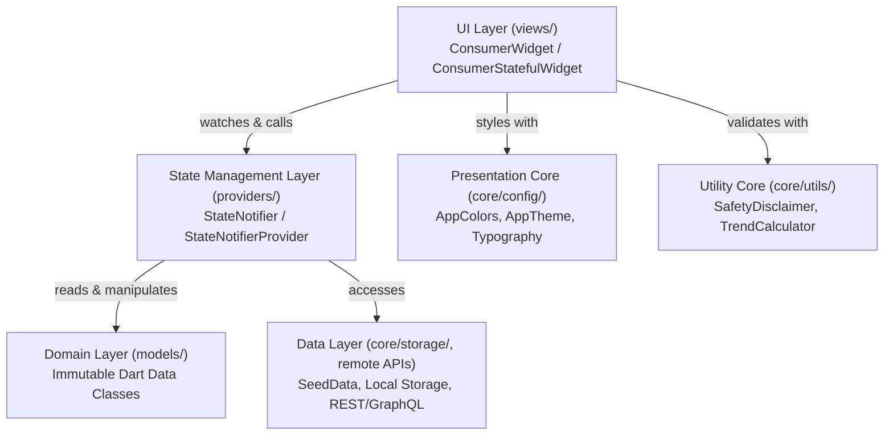

# VistaCortex - Complete Codebase Architecture & File-by-File Guide

This document provides an exhaustive, production-grade guide to the **VistaCortex** Flutter application. It explains the core architecture, data flow, state management, design philosophy, and details **every single file** in the codebase.

---

## 1. High-Level Architecture & Design Patterns

### Architecture Pattern: Feature-First Clean Architecture
The application is structured into decoupled, self-contained feature slices (`lib/features/`) alongside shared foundational utilities (`lib/core/`).



### State Management: Riverpod 2.x
- **No BuildContext dependency** for business logic.
- **Auto-disposing and testable**: State is cleanly separated into `StateNotifier` classes.
- **Unidirectional Data Flow**: User actions in `views/` trigger methods on `providers/`, updating the state, which reactively re-renders dependent `Consumer` widgets.

---

## 2. Directory Tree

```
lib/
├── app.dart                                    # Main App Shell & 5-Tab Navigation Bar
├── main.dart                                   # App Entry Point & ProviderScope
├── core/
│   ├── config/
│   │   ├── app_colors.dart                     # Brand color palette & status hex codes
│   │   ├── app_constants.dart                  # Global constants, animation & timeouts
│   │   └── app_theme.dart                      # Material 3 ThemeData & component styling
│   ├── storage/
│   │   └── seed_data.dart                      # Clinical seed datasets for testing & fallback
│   └── utils/
│       ├── safety_disclaimer.dart              # Medical safety disclaimers & compliance banners
│       └── trend_calculator.dart              # Biomarker slope & percentage trend math
└── features/
    ├── auth/
    │   └── views/
    │       └── welcome_screen.dart             # Onboarding & welcome screen
    ├── dashboard/
    │   └── views/
    │       └── dashboard_screen.dart           # Home health dashboard with vitals & summaries
    ├── reports/                                # Features 1 & 2: Reports & AI Analysis
    │   ├── models/
    │   │   └── report_model.dart               # Models for Reports, Biomarkers & Diet
    │   ├── providers/
    │   │   └── reports_provider.dart           # StateNotifier for search, filtering & upload
    │   └── views/
    │       ├── reports_screen.dart             # Storage hub, search, category chips & upload
    │       ├── report_details_screen.dart      # 3-tab view: Report, AI Analysis, Diet Plan
    │       ├── parameter_trend_screen.dart     # Biomarker historical trend sparklines
    │       └── pdf_view_modal.dart             # In-app clinical document PDF viewer
    ├── reminders/                              # Features 3, 4 & 5: Meds, Refills & Tests
    │   ├── models/
    │   │   └── reminder_model.dart             # Models for Doses, Inventory & Next Tests
    │   ├── providers/
    │   │   └── reminders_provider.dart         # StateNotifier for adherence, refills & tests
    │   └── views/
    │       └── reminders_screen.dart           # 3-tab view: Doses, Refills, Tests
    ├── recovery_care/                          # Feature 6: Surgery Care & Clinical Diet
    │   ├── models/
    │   │   └── recovery_model.dart             # Models for Milestones, Pain Log & Tasks
    │   ├── providers/
    │   │   └── recovery_diet_provider.dart     # StateNotifier for pain scale & rehab tasks
    │   └── views/
    │       └── recovery_care_screen.dart       # 2-tab view: Recovery Protocol & Diet Plan
    ├── test_booking/                           # Feature 7: Diagnostic Lab Test Booking
    │   ├── models/
    │   │   └── test_booking_model.dart         # Models for Tests, Slots & Bookings
    │   ├── providers/
    │   │   └── test_booking_provider.dart      # StateNotifier for catalog, filter & checkout
    │   └── views/
    │       └── test_booking_screen.dart        # Test catalog, home/lab toggle & booking modal
    ├── family_connect/                         # Feature 8: Family Connect & Emergency SOS
    │   ├── models/
    │   │   └── family_model.dart               # Models for Contacts, Permissions & Audit Log
    │   ├── providers/
    │   │   └── family_connect_provider.dart    # StateNotifier for SOS, invites & permissions
    │   └── views/
    │       └── family_connect_screen.dart      # Emergency SOS card, members & audit trail
    └── ai_chat/                                # AI Health Chatbot
        └── views/
            └── ai_chat_screen.dart             # Clinical AI chat with quick suggestion chips
```

---

## 3. Exhaustive File-by-File Breakdown

---

### Root Application Layer

#### `lib/main.dart`
- **Role**: Application entry point.
- **Responsibilities**:
  - Initializes `WidgetsFlutterBinding.ensureInitialized()`.
  - Configures system UI overlay style (`SystemChrome.setSystemUIOverlayStyle`) for an edge-to-edge transparent status bar with dark icons.
  - Wraps the root widget in Riverpod's `ProviderScope` to enable global state injection.
  - Runs `VistaCortexApp`.

#### `lib/app.dart`
- **Role**: Root application container & primary navigation scaffold.
- **Responsibilities**:
  - Instantiates `MaterialApp` configured with `AppTheme.lightTheme`.
  - Manages the bottom navigation state (`_currentIndex`: 0 to 4).
  - Houses the 5 primary tabs:
    1. **Home** (`DashboardScreen`)
    2. **Reports** (`ReportsScreen`)
    3. **AI** (`AiChatScreen`)
    4. **Reminders** (`RemindersScreen`)
    5. **More** (Quick-access menu to *Surgery Care*, *Book Lab Test*, *Family Connect*, and *Settings*).
  - Provides animated tab switching and unified bottom bar styling.

---

### Core Layer (`lib/core/`)

#### `lib/core/config/app_colors.dart`
- **Role**: Central design system token repository.
- **Key Constants**:
  - `primary`: `#2563EB` (Electric Royal Blue - Primary brand actions & active states).
  - `primaryLight`: `#EFF6FF` (Soft blue surface tint for active tabs and containers).
  - `background`: `#F8FAFC` (Slate neutral background).
  - `surface`: `#FFFFFF` (Card and modal elevated surfaces).
  - `textPrimary`: `#0F172A` (High-contrast slate black for titles and data).
  - `textSecondary`: `#64748B` (Muted subtitle grey).
  - `border`: `#E2E8F0` (Light slate hairline border for clean separation).
  - `success`: `#16A34A` / `successLight`: `#DCFCE7` (Normal biomarker status).
  - `warning`: `#D97706` / `warningLight`: `#FEF3C7` (Borderline / Refill warnings).
  - `error`: `#DC2626` / `errorLight`: `#FEE2E2` (Critical out-of-range biomarkers & SOS).
  - `purple`: `#9333EA` / `purpleLight`: `#F3E8FF` (Family Connect & Sharing tokens).

#### `lib/core/config/app_constants.dart`
- **Role**: Shared application constants.
- **Responsibilities**:
  - Defines app metadata (app name, semantic version, API base URLs).
  - Holds standard animation durations (e.g., 250ms page transitions).
  - Configures local cache keys and default timeout constraints.

#### `lib/core/config/app_theme.dart`
- **Role**: Material 3 theme configuration.
- **Responsibilities**:
  - Constructs `ThemeData` specifying:
    - Typography using clean geometric sans-serif fonts.
    - `CardTheme` with 16px rounded borders and subtle elevations.
    - `InputDecorationTheme` with border styling, prefix icon alignments, and padding.
    - `ElevatedButtonThemeData` with 12px radii and primary brand fill.
    - `AppBarTheme` with white background, zero elevation, and dark icons.

#### `lib/core/storage/seed_data.dart`
- **Role**: Comprehensive clinical mock database.
- **Responsibilities**:
  - Supplies realistic healthcare datasets for offline operation, demos, and automated tests.
  - Contains seed objects for:
    - 4 complete medical lab reports (CMP, Lipid Panel, CBC, Brain MRI) with real clinical parameters.
    - 4 daily prescribed medicines with dosage timings and refill stocks.
    - 2 scheduled upcoming diagnostic tests with fasting requirements.
    - Surgery recovery protocol (Day 14 Laparoscopic Appendectomy) with 4 rehab tasks and 4 diet phases.
    - 3 family members with permission tiers and an emergency SOS contact.

#### `lib/core/utils/safety_disclaimer.dart`
- **Role**: Medico-legal safety compliance widget.
- **Responsibilities**:
  - Renders `SafetyDisclaimerBanner` (compact or full-card mode).
  - Warns patients that AI-generated summaries are assistive and must not replace professional diagnosis or emergency medical care.

#### `lib/core/utils/trend_calculator.dart`
- **Role**: Mathematical engine for biomarker analysis.
- **Responsibilities**:
  - Computes historical biomarker percentage shifts between visits.
  - Evaluates clinical trajectory: `improving`, `worsening`, or `stable` based on parameter normal reference limits.
  - Generates normalized data points for sparkline chart rendering.

---

### Features Layer (`lib/features/`)

---

### Authentication & Dashboard (`auth/` & `dashboard/`)

#### `lib/features/auth/views/welcome_screen.dart`
- **Role**: First-launch onboarding & sign-in screen.
- **Responsibilities**:
  - Displays hero medical branding, value proposition cards (Report AI, Med Reminders, Caregiver Sync).
  - Provides "Get Started" button routing directly into the main application.

#### `lib/features/dashboard/views/dashboard_screen.dart`
- **Role**: Main home dashboard consolidating all health modules.
- **Responsibilities**:
  - Top header displaying personalized patient greeting and notification bell.
  - **Health Score Card**: Visual ring displaying overall wellness adherence.
  - **Quick Action Grid**: 4 prominent shortcuts:
    - `Upload Report` ➔ Opens report upload modal.
    - `Book Test` ➔ Navigates to Test Booking catalog.
    - `Surgery Care` ➔ Navigates to Post-Op protocol.
    - `Emergency SOS` ➔ Triggers Family Connect emergency dial.
  - **Upcoming Appointment Card**: Shows doctor name, specialty, date, and "Join Call" trigger.
  - **Today's Medication Doses**: Live preview of upcoming pill reminders with 1-tap "Taken" button.
  - **Recent Reports Preview**: Latest lab test card showing biomarker status pill.

---

### Feature 1 & 2: Reports & AI Analysis (`reports/`)

#### `lib/features/reports/models/report_model.dart`
- **Role**: Domain model for medical reports and clinical analysis.
- **Classes**:
  - `MedicalReport`: Contains `id`, `testName`, `category`, `labName`, `date`, `pdfUrl`, `summary`, `parameters`, `questionsForDoctor`, `dietPlan`.
  - `ReportParameter`: Represents a single biomarker with `name`, `value`, `unit`, `referenceRange`, `status` (`ParameterStatus.normal`, `borderline`, `critical`), and `description`.
  - `DietRecommendation`: Holds dietary advice linked to test findings (`category`, `foodsToEat`, `foodsToAvoid`, `rationale`).

#### `lib/features/reports/providers/reports_provider.dart`
- **Role**: State management for diagnostic reports.
- **State**: `ReportsState` (`reportsList`, `filteredReports`, `selectedCategory`, `searchQuery`, `isUploading`).
- **Methods**:
  - `filterByCategory(category)`: Filters reports by `All`, `Critical`, or `Routine`.
  - `searchReports(query)`: Real-time search across report names and lab centers.
  - `simulateUploadReport(file)`: Simulates OCR transcription and prepends new report to state.

#### `lib/features/reports/views/reports_screen.dart`
- **Role**: Central records storage UI.
- **Responsibilities**:
  - Search bar and category filter chips.
  - Scrollable list of diagnostic reports displaying test name, lab, date, and abnormality indicators.
  - Floating Action Button (`+ Upload`) opening a modal sheet for PDF upload or camera document scanning.

#### `lib/features/reports/views/report_details_screen.dart`
- **Role**: Detailed clinical breakdown screen with 3 tabs:
  - **Tab 1: Report**: General summary, doctor notes, and PDF viewer launcher.
  - **Tab 2: Analysis**: Interactive parameter tiles with normal range bars, critical warning pills, and generated doctor discussion questions.
  - **Tab 3: Diet Plan**: Customized nutrition protocol addressing abnormalities found in the test.

#### `lib/features/reports/views/parameter_trend_screen.dart`
- **Role**: Historical biomarker trend screen.
- **Responsibilities**:
  - Displays a graphical timeline showing biomarker progression over past tests.
  - Visualizes normal reference range corridors and improvement indicators.

#### `lib/features/reports/views/pdf_view_modal.dart`
- **Role**: In-app clinical document viewer.
- **Responsibilities**:
  - Renders the original laboratory report PDF with page navigation, zoom controls, and export options.

---

### Features 3, 4 & 5: Reminders, Refills & Tests (`reminders/`)

#### `lib/features/reminders/models/reminder_model.dart`
- **Role**: Domain model for medication adherence, inventory, and scheduled tests.
- **Classes**:
  - `MedicineDose`: Models an individual dose (`medicineId`, `medicineName`, `dosage`, `timeSlot`, `status`, `skipReason`).
  - `MedicineInventory`: Models pharmacy stock (`medicineId`, `currentStock`, `dailyUsage`, `remainingDays`, `prescribedBy`).
  - `NextScheduledTest`: Models future diagnostic tests (`testName`, `dueDate`, `fastingRequired`, `instructions`).

#### `lib/features/reminders/providers/reminders_provider.dart`
- **Role**: Business logic for dosing schedules, stock replenishment, and follow-ups.
- **State**: `RemindersState` (`todayDoses`, `inventoryList`, `nextTests`, `adherencePercentage`).
- **Methods**:
  - `markDoseTaken(doseId)`: Updates dose status to taken, advances adherence score, and deducts 1 from pill inventory.
  - `markDoseSkipped(doseId, reason)`: Records clinical skip reason without penalizing adherence.
  - `refillStock(medicineId, amount)`: Replenishes tablet inventory count and clears low-stock warnings.
  - `markNextTestCompleted(testId)`: Archives scheduled diagnostic tests.

#### `lib/features/reminders/views/reminders_screen.dart`
- **Role**: 3-tab medication and test management screen:
  - **Tab 1: Doses**: Visual adherence circle, Morning/Afternoon/Evening filter chips, interactive Taken/Skipped cards, and "+ Add Medicine" modal.
  - **Tab 2: Refills**: Inventory tracking cards with days-left counters, low-stock warning banners, and 1-tap `+30 Refill` buttons.
  - **Tab 3: Tests**: Scheduled diagnostic tests with fasting requirement badges and direct "Book Test" shortcut buttons.

---

### Feature 6: Recovery Care & Surgery Protocol (`recovery_care/`)

#### `lib/features/recovery_care/models/recovery_model.dart`
- **Role**: Domain model for post-surgical care and recovery nutrition.
- **Classes**:
  - `SurgeryRecoveryPlan`: Holds `surgeryName`, `surgeryDate`, `surgeonName`, `hospital`, `currentPostOpDay`, `painScore`, `tasks`, `dietStages`.
  - `RecoveryTask`: Models daily rehab tasks (`title`, `timeOfDay`, `isCompleted`).
  - `RecoveryDietItem`: Models surgical nutrition requirements (`title`, `description`, `benefitTag`).

#### `lib/features/recovery_care/providers/recovery_diet_provider.dart`
- **Role**: State management for post-operative recovery.
- **Methods**:
  - `updatePainScore(score)`: Sets patient pain rating (1-10) and flags severe pain for physician review.
  - `toggleTaskCompletion(taskId)`: Checks off dressing changes, breathing exercises, and mobility tasks.

#### `lib/features/recovery_care/views/recovery_care_screen.dart`
- **Role**: 2-tab post-op recovery screen:
  - **Tab 1: Recovery**: Displays post-op day badge, interactive 1-10 pain scale selector, and daily care task checklist.
  - **Tab 2: Diet**: Clinical post-surgical dietary phases (Clear liquids, soft foods, high-protein tissue recovery, hydration).

---

### Feature 7: Test Booking (`test_booking/`)

#### `lib/features/test_booking/models/test_booking_model.dart`
- **Role**: Domain model for diagnostic lab test booking.
- **Classes**:
  - `DiagnosticTestItem`: Models test packages (`id`, `title`, `description`, `price`, `originalPrice`, `discountPercentage`, `fastingHours`, `category`).
  - `BookingSlot`: Holds scheduled date and time window.
  - `BookingConfirmation`: Holds confirmed booking voucher and booking reference number.

#### `lib/features/test_booking/providers/test_booking_provider.dart`
- **Role**: State management for test catalog and checkout.
- **Methods**:
  - `selectCategory(category)`: Filters catalog by Cardiology, Diabetes, Full Body, etc.
  - `searchTests(query)`: Filters catalog by test name.
  - `setServiceMode(mode)`: Toggles between Home Collection and Lab Visit.
  - `bookTestSlot(testItem, date, timeSlot, address)`: Confirms booking and generates reference ticket.

#### `lib/features/test_booking/views/test_booking_screen.dart`
- **Role**: Lab test catalog and booking UI.
- **Responsibilities**:
  - Search bar and category filters.
  - Home Sample Collection vs. Lab Visit toggle.
  - Diagnostic test cards with pricing, savings badge, and "Book Now" trigger.
  - Modal bottom sheet with calendar date picker, time slot selector, and booking confirmation.

---

### Feature 8: Family Connect (`family_connect/`)

#### `lib/features/family_connect/models/family_model.dart`
- **Role**: Domain model for family caregiving and emergency SOS.
- **Classes**:
  - `FamilyMember`: Models connected relatives (`id`, `name`, `relationship`, `phone`, `avatarUrl`, `permissionLevel`, `isEmergencyContact`).
  - `AccessAuditLogEntry`: Records record access history (`timestamp`, `memberName`, `actionDescription`).

#### `lib/features/family_connect/providers/family_connect_provider.dart`
- **Role**: State management for emergency sharing.
- **Methods**:
  - `inviteFamilyMember(name, relationship, phone, permission)`: Adds a new caregiver to the circle.
  - `updatePermission(memberId, newPermission)`: Adjusts role between Full Access, View Only, and Emergency Only.
  - `toggleEmergencyContact(memberId)`: Designates primary SOS speed dial recipient.
  - `triggerEmergencySOS()`: Broadcasts emergency alert with patient status.

#### `lib/features/family_connect/views/family_connect_screen.dart`
- **Role**: Emergency SOS and family circle UI.
- **Responsibilities**:
  - Prominent red Emergency SOS speed dial card.
  - Privacy consent banner confirming full user data control.
  - Caregiver list cards with permission dropdown and remove access action.
  - "+ Invite Member" modal sheet.
  - Collapsible Access Audit Log showing chronological access records.

---

### AI Health Assistant (`ai_chat/`)

#### `lib/features/ai_chat/views/ai_chat_screen.dart`
- **Role**: Clinical conversational assistant interface.
- **Responsibilities**:
  - Renders conversational message bubbles with timestamp and speaker distinction (User vs. VistaCortex AI).
  - Quick clinical suggestion chips ("Explain my lab report", "What does high Creatinine mean?", "Medication interactions").
  - Safety disclaimer footer.
  - Text input field with voice query trigger.

---

## 4. Platform Configuration Files

### `pubspec.yaml`
- **Role**: Project dependencies and asset registry.
- **Key Packages**:
  - `flutter_riverpod: ^2.5.1` - State management.
  - `google_fonts: ^6.2.1` - Clean typography.
  - `intl: ^0.19.0` - Date and currency formatting.
  - `path_provider: ^2.1.3` - File storage access for PDFs.

### `android/app/build.gradle`
- **Role**: Android build engine configuration.
- **Key Settings**:
  - `compileSdkVersion 34`
  - `minSdkVersion 21` (supports Android 5.0 through Android 15/17).
  - `targetSdkVersion 34`.
  - Configured for multi-dex and ProGuard tree-shaking.

### `android/app/src/main/AndroidManifest.xml`
- **Role**: Android OS permissions and activity declarations.
- **Permissions**:
  - `android.permission.INTERNET` - Cloud API sync and tele-health connections.
  - `android.permission.CAMERA` - Lab document scanning.
  - `android.permission.READ_MEDIA_IMAGES` - Document gallery picker.
  - `android.permission.SCHEDULE_EXACT_ALARM` - Precise medication reminders.

---

## 5. Development & Testing Workflow

```powershell
# 1. Start Pixel 9 emulator
& "C:\Users\sudha\AppData\Local\Android\Sdk\emulator\emulator.exe" -avd Pixel_9

# 2. Run app with live hot reload
cd "c:\Users\sudha\Downloads\VISTACORTEX\new features app"
& "C:\src\flutter\bin\flutter.bat" run

# 3. Build release APK
& "C:\src\flutter\bin\flutter.bat" build apk --release

# 4. Install release APK directly on emulator or physical phone
& "C:\Users\sudha\AppData\Local\Android\Sdk\platform-tools\adb.exe" install -r "c:\Users\sudha\Downloads\VISTACORTEX\VistaCortex_release.apk"
```
